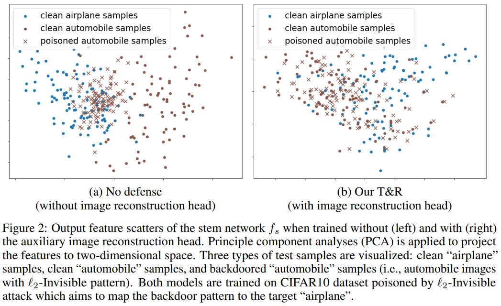

# Trap and replace: A decrease-and-conquer strategy for backdoor defense. 

This is the official code for NeurIPS'22 [paper](https://arxiv.org/abs/2210.06428) "Trap and Replace: Defending Backdoor Attacks by Trapping Them into an Easy-to-Replace Subnetwork". 

The major finding: A simple image reconstruction loss can successfully trap backdoors into a small subnetwork while preserving the rest of the network largely uncontaminated (see Fig. 2).



Intuition: Image reconstruction task encourages the stem network to keep sufficient low-level visual features that are hard-to-learn but semantically correct, protecting the stem network from overfitting to the easy-to-learn but semantically incorrect backdoor correlations.

Why is this important: It provides a promising decrease-and-conquer strategy for backdoor defense. Since the stem network is largely uncontaminated, defenders only need to tackle the small backdoored subnetwork, which is easier than sanitizing the entire model as done previously.


## Download datasets

### clean-label backdoor attack on CIFAR-10

Use the script `download_clba.sh` in `datasets` folder. 
After downloading the dataset, put it into the folder `<args.data_root_path>/CIFAR10-CLBA`. For example, the `npy` file we use in our experiments is in `<args.data_root_path>/CIFAR10-CLBA/fully_poisoned_training_datasets/inf_16.npy`

## Normal training

Run 

```
python normal_training.py --gpu <gpu_id> --ds <dataset> --pattern <attack> --ratio_holdout <ratio_holdout>
```

For example:

```
python normal_training.py --gpu 0 --ds cifar10 --pattern badnet_sq --ratio_holdout 0.05
```

```
python normal_training.py --gpu 0 --ds gtsrb --target 1 --pattern badnet_grid --ratio_holdout 0.05
```

```
python normal_training.py --ds imagenet12 --md ResNet34 -e 90 --opt sgd --lr 0.1 -b 256 --pattern blend --gpu 0 --cpus 64 --tb 100 
```

## Our method stage 1: Bait and trap

Run 

```
python backdoor_trapper_bait_and_trap.py --gpu <gpu_id> --ds <dataset> --pattern <attack> --ratio_holdout <ratio_holdout>
```

For example:

```
python backdoor_trapper_bait_and_trap.py --gpu 0 --ds cifar10 --pattern badnet_grid --ratio_holdout 0.05
```

```
python backdoor_trapper_bait_and_trap.py --gpu 0 --ds gtsrb --target 1 --pattern badnet_grid --ratio_holdout 0.05
```

```
python backdoor_trapper_bait_and_trap.py --ds imagenet12 --ratio_holdout 0.1 --md ResNet34 -e 90 --opt sgd --lr 0.1 -b 256 --pattern blend --gpu 0 --cpus 64 --tb 100 --stem 31
```

## Our method stage 2: Remove and patch

Run

```
python backdoor_trapper_remove_and_patch.py --gpu <gpu_id> --ds <dataset> --pattern <attack> --ratio_holdout <ratio_holdout>
```

For example:

```
python backdoor_trapper_remove_and_patch.py --gpu 0 --ds cifar10 --pattern badnet_grid --ratio_holdout 0.05
```

```
python backdoor_trapper_remove_and_patch.py --gpu 0 --ds gtsrb --target 1 --pattern badnet_grid --ratio_holdout 0.05
```

```
python backdoor_trapper_remove_and_patch.py --ds imagenet12 --ratio_holdout 0.1 --md ResNet34 -e 90 --opt sgd --lr 0.1 -b 256 --dropout 0.5 --pattern blend --gpu 0 --cpus 64 --tb 100 --stem 31
```

## Citation
```
@inproceedings{wang2022trap,
  title={Trap and Replace: Defending Backdoor Attacks by Trapping Them into an Easy-to-Replace Subnetwork},
  author={Wang, Haotao and Hong, Junyuan and Zhang, Aston and Zhou, Jiayu and Wang, Zhangyang},
  booktitle={Advances in Neural Information Processing Systems},
  year={2022}
}
```